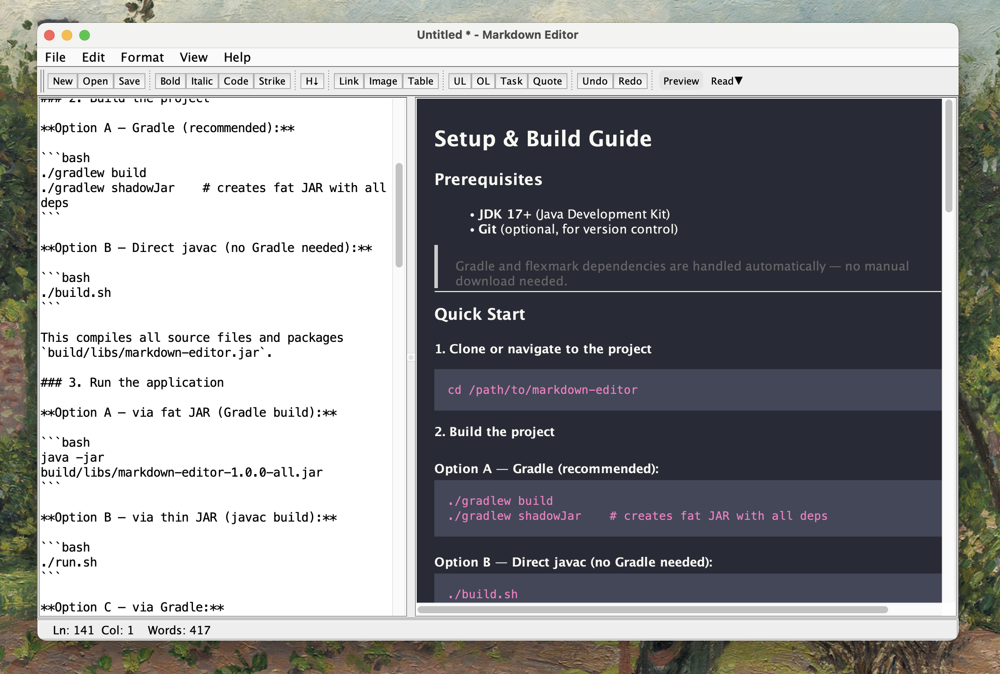
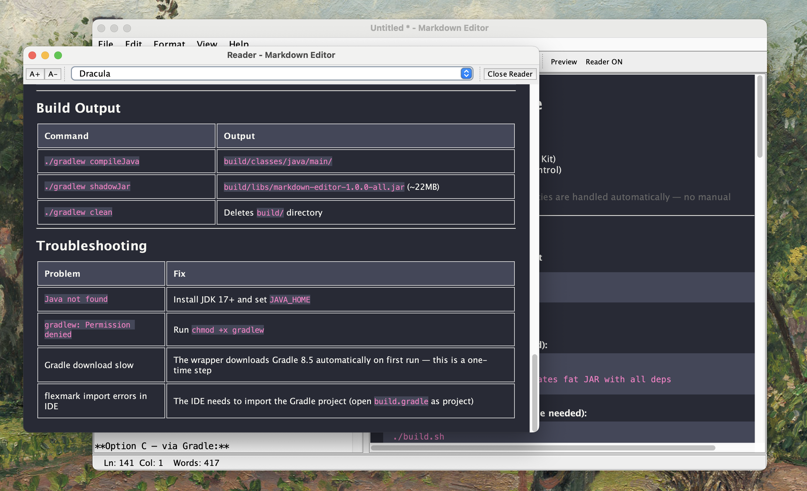
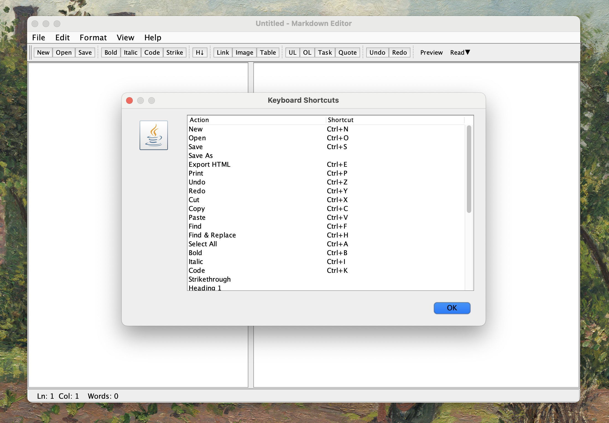

# Markdown Editor






A desktop Markdown editor with live HTML preview, built with Java Swing and [flexmark](https://github.com/vsch/flexmark-java).

## Features

- **Split-pane editing** — raw Markdown on the left, rendered HTML on the right
- **Live preview** — debounced (300ms) auto-rendering as you type
- **Toolbar formatting** — bold, italic, code, strikethrough, headings, links, images, tables, lists, blockquotes
- **Reading Mode** — Pop-out Reader (separate window) or Focus View (full-width preview)
- **Themes** — Light, Dark, Sepia
- **File operations** — open/save `.md` files, export to HTML
- **Undo/Redo** — full history via `UndoManager`
- **Keyboard shortcuts** — Ctrl+S, Ctrl+Z/Y, Ctrl+B/I/K, Ctrl+Shift+R, and more
- **Status bar** — cursor position, word count, modified indicator

## Prerequisites

- **JDK 17+**

## Quick Start

```bash
# Build
./build.sh

# Run
./run.sh
```

Or with Gradle:

```bash
./gradlew shadowJar
java -jar build/libs/markdown-editor-1.0.0-all.jar
```

## Project Structure

```
src/main/java/com/mdeditor/
├── Main.java                      # Entry point
├── ui/                            # UI components
│   ├── MainFrame.java             # Main window (JFrame + JSplitPane)
│   ├── EditorPanel.java           # JTextArea (editor)
│   ├── PreviewPanel.java          # JEditorPane (HTML preview)
│   ├── StatusBar.java             # Line/col, word count
│   └── reading/                   # Reading Mode
│       ├── ReadingManager.java    # Orchestrates Pop-out & Focus modes
│       ├── ReadingFrame.java      # Separate reader window
│       └── ReadingToolBar.java    # Reader toolbar
├── markdown/
│   └── MarkdownProcessor.java     # flexmark wrapper (md → html)
├── document/
│   ├── FileManager.java           # Open/save file logic
│   └── DocumentState.java         # Undo, dirty flag, file path
├── formatting/
│   └── InsertActions.java         # Insert markdown syntax at cursor
├── preview/
│   └── ThemeManager.java          # CSS theming (Light/Dark/Sepia)
└── util/
    └── KeyboardShortcuts.java     # Key bindings
```

## License

MIT
